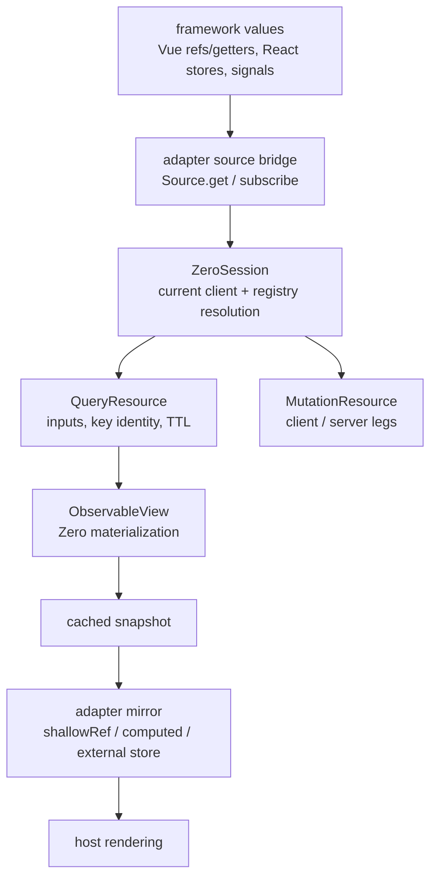

Four ideas carry the whole package: a source is a pullable value, definitions are immutable, the session owns the client, and every resource owns its inputs.

## Source

A `Source<T>` is the framework-neutral boundary between a reactivity system and Zero:

```ts
export type Source<T> = {
  get(): T;
  subscribe(listener: () => void): () => void;
};

export type SourceInput<T> = T | Source<T>;
```

- `get()` returns the current value. Core never caches it for you.
- `subscribe()` only reports that the value _may_ have changed; consumers pull with `get()`. A subscription never needs to invoke its listener immediately, and unsubscribing is idempotent.
- `toSource(input)` normalizes any `SourceInput`: a source passes through, anything else becomes a constant source with a no-op subscription, so every input can be handled uniformly.
- `createSource(get, subscribe?)` builds one; omitting `subscribe` uses the same no-op subscription.

Core does not know whether a source is a Vue ref, a React store, a signal, or a custom observable. Function-valued query and mutator getters remain **values** unless an adapter deliberately wraps their dynamic evaluation in a source — the Vue bridge does exactly that.

## Definitions

`createDefinitions(options)` returns immutable, client-free registry definitions:

```ts
import { createDefinitions } from "zero-bindings";

export const definitions = createDefinitions({ schema, queries, mutators });
```

It holds the schema, an optional `context`, and the optional query and mutator registries, and nothing else — no client, subscriptions, resources, or mutable runtime state. The caller's `queries`/`mutators` objects are frozen in place, as is the returned container, so a registry handed to `createDefinitions` stays immutable for its lifetime.

Getters resolve against the registry in four forms:

```ts
session.createQuery((queries) => queries.issue.all()); // registry callback
session.createQuery("issue.all"); // registry entry name
session.createQuery(["issue.filtered", { projectId: "p1" }]); // name + arguments
session.createMutation(() => myDirectMutator); // direct signal, called with no arguments
```

An unresolvable query getter throws an `InvalidQuery` error (`{ type, message }`), which the query resource turns into an error snapshot. An unresolvable mutator getter throws an `InvalidMutator` error from `mutate()` instead of publishing a mutation snapshot.

## Session

`ZeroSession.create(definitions, { client })` builds one application instance's live Zero layer. There is no separate runtime object: the session **is** the client holder.

The session owns:

- the current client and its source subscription;
- registry getter resolution — a bound getter plus the registry become the query signal a resource reads;
- resource registration and disposal of every resource it created;
- client replacement fan-out.

`client` is a `SourceInput<Zero | undefined>`: a plain client, a ref/getter bridged into a source, or a core `Source`. Replacing client A with B synchronously rematerializes active queries **under the same resources and listeners**; replacing with `undefined` publishes the stable `unknown` snapshot, and no teardown-only state is ever published. A client source that throws is recorded rather than propagated: the session detaches, settles active queries as `error`, and clears the error on the next successful read or `setClient()`. The session never closes the Zero client it was given.

## Resources

Resources are the values applications read. Session factories are **inert**: `createQuery()` and `createMutation()` build a resource, and only `start()` subscribes to inputs and materializes.

Each query resource owns its reactive inputs while active:

- the query signal,
- `enabled`,
- `ttl`.

An input notification rematerializes only when the resolved query key changed. Disabled values, falsy signals, and resolution errors rematerialize unconditionally. A TTL change updates the live view without rematerializing.

`stop()` releases the materialized view and the input subscriptions while retaining the last snapshot; `dispose()` is terminal. Source reactions never restart a stopped resource — only an explicit `start()` does. `subscribe()` neither starts nor stops anything.

Mutation resources own their client/server legs instead: `mutate()`, `reset()`, and a cached `{ client, server }` snapshot.

## One orchestration path

`ObservableView` is the only Zero `Output` implementation in the package. It owns the materialized tree, transaction batching, completion/error handling, the cached snapshot, listener notification, and view destruction.

Adapters convert host values into sources, mirror cached snapshots into host state, and bridge host teardown. They never call `applyChange`, `skipYields`, or `zero.materialize()`, and they never maintain a second query or mutation path.



Next: [Development](/development).
